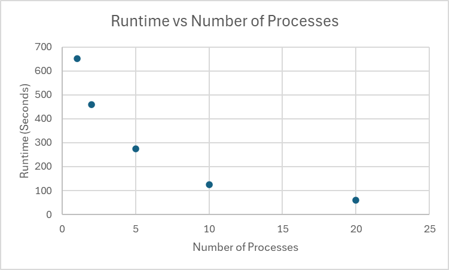

# System Programming Lab 11 Multiprocessing

## Overview
This program generates a zooming animation of the Mandelbrot set using multi-processing. It supports dynamic scaling and adjustable parameters such as the number of processes, resolution, and zoom depth. The program is optimized for modern multi-core systems, using up to 32 threads. The final result is a sequence of images that can be combined into a 4K 30 FPS movie.


## Runtime Analysis
The program was tested with 1, 2, 5, 10, and 20 child processes to measure its scalability. Below is the runtime comparison:



## Discussion
The graph above shows the relationship between the number of child processes and the runtime:

- **Scalability**: Increasing the number of processes significantly reduces runtime.
- **Diminishing Returns**: Beyond 10 processes, the improvement becomes less noticeable.

## Compilation and Execution Instructions

### 1. Compile the Program
To compile the `mandelmovie` program, run the following command:

```bash
gcc -o mandelmovie mandelmovie.c jpegrw.c -ljpeg -lm
```

### Part 2: Running the Program
To generate the entire sequence of images and convert them into a movie, use the following commands:

```bash
./mandelmovie -x <x_center> -y <y_center> -s <scale> -W <width> -H <height> -m <max_iterations> -n <num_images> -p <num_processes>
ffmpeg -framerate 30 -i mandel%d.jpg -c:v libx264 -pix_fmt yuv420p -crf 18 -preset slow mandelzoom.mp4
```
