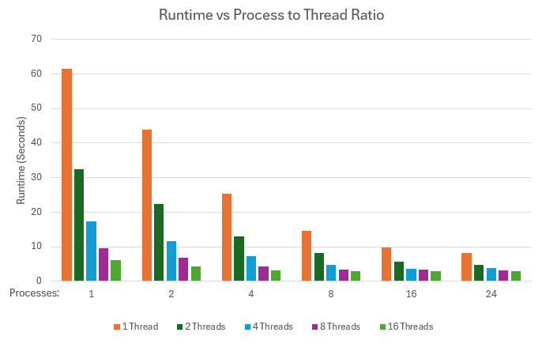

# System Programming Lab Multi-processing and Multi-threading

## Overview
This program generates a zooming animation of the Mandelbrot set using multi-processing and multi-threading. It supports dynamic scaling and adjustable parameters such as the number of processes, number of threads, resolution, and zoom depth. The program is optimized for modern multi-core systems. The final result is a sequence of images that can be combined into a 4K 30 FPS movie.


## Runtime Analysis (Multi-processing)
The program was tested with 1, 2, 5, 10, and 20 child processes to measure its scalability. Below is the runtime comparison:


## Runtime Analysis (Multi-processing and Multi-threading)
To evaluate the performance of the program with both multi-processing and multi-threading, tests were conducted with combinations of child processes (-p) and threads per process (-t). Below is a table and graph of the runtime results for generating 50 images at 720p resolution with 500 maximum iterations.

| **Processes \ Threads** | **1 Thread** | **2 Threads** | **4 Threads** | **8 Threads** | **16 Threads** |
|--------------------------|--------------|---------------|---------------|---------------|----------------|
| **1 Process**           | 61.445 s     | 32.548 s      | 17.340 s      | 9.596 s       | 6.134 s        |
| **2 Processes**          | 43.776 s     | 22.355 s      | 11.655 s      | 6.830 s       | 4.263 s        |
| **4 Processes**          | 25.257 s     | 12.905 s      | 7.351 s       | 4.401 s       | 3.191 s        |
| **8 Processes**          | 14.728 s     | 8.201 s       | 4.741 s       | 3.314 s       | 3.024 s        |
| **16 Processes**         | 9.737 s      | 5.588 s       | 3.644 s       | 3.338 s       | 3.000 s        |
| **24 Processes**         | 8.210 s      | 4.833 s       | 3.800 s       | 3.273 s       | 3.024 s        |



## Discussion
- **Impact of Multi-threading**: Increasing threads per process had a significant impact, especially at low process counts. This is because threads efficiently share       memory within the same process, reducing overhead compared to spawning multiple processes.
- **Impact of Multi-processing**: Increasing processes showed consistent improvements in runtime, particularly at higher thread counts. Multi-processing utilized all available CPU cores effectively, distributing the workload across physical resources.
- **Scalability**: The program demonstrated excellent scalability up to 16 processes. Beyond that, the benefits diminished as the system approached its maximum hardware capacity

## Compilation and Execution Instructions

### 1. Compile the Program
To compile the `mandelmovie` program, run the following command:

```bash
gcc -o mandelmovie mandelmovie.c jpegrw.c -ljpeg -lm
```

### Part 2: Running the Program
To generate the entire sequence of images and convert them into a movie, use the following commands:

```bash
./mandelmovie -x <x_center> -y <y_center> -s <scale> -W <width> -H <height> -m <max_iterations> -n <num_images> -p <num_processes>
ffmpeg -framerate 30 -i mandel%d.jpg -c:v libx264 -pix_fmt yuv420p -crf 18 -preset slow mandelzoom.mp4
```
